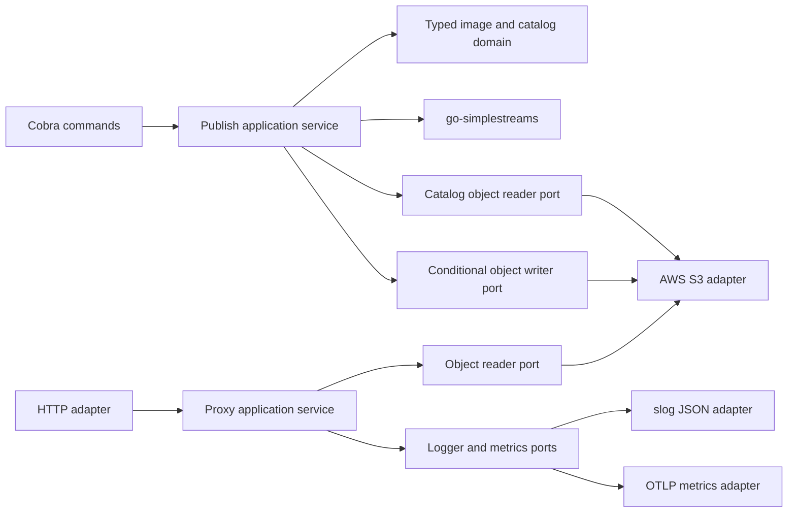

# `simplestreams-s3` Design

Status: proposed; Incus wire compatibility remains gated by the phase-one spike
Scope: initial Incus virtual-machine release

## 1. Purpose

`simplestreams-s3` publishes split Incus virtual-machine images to a private Amazon S3 bucket and exposes those objects through a Simple Streams-compatible HTTP endpoint.

The binary has two commands:

- `simplestreams-s3 publish METADATA_TARBALL DISK_QCOW2` validates and publishes one split Incus VM image and its Simple Streams metadata.
- `simplestreams-s3 proxy` serves the configured S3 prefix as a read-only HTTP mirror.

Simple Streams is a static file layout, not an application API. The proxy therefore performs path translation and authenticated S3 reads only. Metadata generation, catalog updates, image inspection, and content rewriting occur only in `publish`.

## 2. Normative language

`MUST`, `MUST NOT`, `SHOULD`, `SHOULD NOT`, and `MAY` define requirements in this document. V1 means the first supported release described here.

## 3. Goals

V1 MUST:

- use `github.com/meigma/go-simplestreams` for protocol paths, documents, builders, checksums, and Incus product validation;
- accept and publish split Incus VM images;
- keep the S3 bucket private and use authenticated AWS API calls for every object operation;
- publish complete catalogs without exposing partial image state;
- serve metadata and artifacts without rewriting them;
- survive transient network and S3 failures without process corruption or unbounded waits;
- emit production-grade JSON logs to stdout in proxy mode;
- optionally export metrics over OTLP;
- load configuration from flags, environment variables, or one optional configuration file;
- expose liveness and readiness endpoints;
- preserve clean hexagonal package boundaries;
- validate external values once and pass strong domain types inward;
- document every named type, function, and method, including unexported declarations.

## 4. Non-goals

V1 MUST NOT:

- support Incus containers;
- claim LXD compatibility;
- accept unified Incus image tarballs;
- generate metadata in proxy mode;
- rewrite paths, documents, aliases, checksums, or response bodies in proxy mode;
- expose direct public S3 URLs or presigned URLs;
- make the S3 bucket public;
- provide directory listings;
- sign Simple Streams metadata;
- delete images or perform catalog garbage collection;
- cache S3 objects in memory or on disk;
- terminate public TLS;
- authenticate or authorize downstream HTTP clients;
- support multiple buckets, tenants, or catalogs in one process;
- promise compatibility with non-AWS S3 implementations;
- convert, recompress, or build image artifacts;
- serve stale objects while S3 is unavailable;
- export OpenTelemetry traces or logs;
- hot-reload configuration.

TLS and external access control belong to the ingress or reverse proxy in front of `simplestreams-s3 proxy`. The application HTTP listener is plain HTTP inside the trusted deployment boundary.

## 5. Security and deployment boundary

The private bucket protects objects from direct unauthenticated S3 access. It does not make the proxy endpoint private. The proxy authenticates to S3 but does not authenticate downstream clients. Any client that can reach the listener can read every valid object path under the configured prefix.

Operators MUST place the listener behind an ingress or network boundary that provides HTTPS and the required client-access policy. A deployment that requires private image distribution MUST enforce that policy outside this application. The configured S3 prefix MUST be dedicated to the mirror; unrelated or sensitive objects MUST NOT share it. The publisher MUST be the only routine writer to that prefix.

The production bucket MUST have S3 Block Public Access enabled and MUST NOT grant public bucket-policy or ACL access. The application consumes an existing bucket and does not create or reconfigure bucket policy, encryption, versioning, or lifecycle rules.

The proxy MUST NOT expose S3 credentials, presigned URLs, bucket names, AWS authorization details, or arbitrary S3 metadata. Its AWS identity MUST be restricted to the configured bucket and prefix. Production AWS and OTLP connections MUST use verified TLS. SDK wire logging is prohibited because signed requests contain sensitive material.

## 6. Inputs and ownership

### 6.1 Published image format

`publish` accepts exactly two local files:

1. an Incus metadata tarball, conventionally named `incus.tar.xz`; and
2. a QCOW2 virtual-machine disk, conventionally named `disk.qcow2`.

The metadata archive MUST contain exactly one regular-file `metadata.yaml` with these non-empty fields:

- `architecture`;
- `creation_date` as a positive Unix timestamp;
- `properties.os`;
- `properties.release`;
- `properties.variant`;
- `properties.architecture`;
- `properties.description`.

Archive inspection MUST be streaming and bounded to `64 MiB` of expanded archive data and `1 MiB` for `metadata.yaml`. Duplicate `metadata.yaml` entries, symlinks, unsafe member paths, and oversized metadata are invalid. The disk MUST have a valid QCOW2 header. Container root filesystems, `rootfs.squashfs`, `rootfs.tar.*`, `lxd.tar.*`, and unified image tarballs MUST be rejected; v1 does not convert another disk format to QCOW2.

V1 supports two architecture identities:

| Incus architecture identity | Accepted metadata names | Simple Streams value |
|---|---|---|
| 64-bit x86 | `x86_64`, `amd64` | `amd64` |
| 64-bit Arm | `aarch64`, `arm64` | `arm64` |

Both architecture fields in `metadata.yaml` MUST resolve to the same row. All other values are unsupported in v1.

The final product metadata MUST contain:

- at least one alias;
- architecture;
- operating system;
- release;
- release title;
- variant;
- requirements, which MAY be empty;
- one sortable version identifier;
- an `incus.tar.xz` item;
- a `disk-kvm.img` item.

The publisher treats the archive as authoritative for architecture, creation time, operating system, release, and variant. `properties.description` is validated as part of the Incus input contract but is not projected in v1. The publisher adds the default alias `<os>/<release>/<variant>` plus any configured aliases. `release_title` defaults to `properties.release` and MAY be overridden explicitly. V1 emits an empty, typed requirements object.

The product name is `<os>:<release>:<variant>:<architecture>`. The version identifier is the UTC creation time formatted as `YYYYMMDDHHMM`. Neither identity is user-overridable in v1. Reusing an identity with different metadata or bytes is a conflict.

The in-memory model MUST make the VM-only rule structural: a validated `VMImage` contains exactly one metadata artifact and one QCOW2 disk artifact. A generic image type with an open-ended file-type string is prohibited.

### 6.2 S3 namespace ownership

The configured bucket and optional key prefix define one owned mirror root. The prefix is empty or a slash-separated relative path with no leading slash, trailing slash, empty component, dot segment, or backslash. It is rejected rather than cleaned. Inside that root, v1 owns:

```text
streams/v1/index.json
streams/v1/images-<document-sha256>.json
images/<metadata-sha256>.incus.tar.xz
images/<disk-sha256>.qcow2
```

Artifact keys are content-addressed and immutable. A product snapshot key includes the SHA-256 of the rendered document and is immutable. `streams/v1/index.json` is the only mutable publication pointer.

The product document uses the fixed Incus values `content_id: images` and `datatype: image-downloads`. Each version contains exactly these items:

- item `incus.tar.xz` with file type `incus.tar.xz`, the metadata artifact checksum and size, and `combined_disk-kvm-img_sha256` set to the Incus fingerprint;
- item `disk-kvm.img` with file type `disk-kvm.img` and the disk artifact checksum and size.

The fingerprint is SHA-256 over the metadata bytes followed immediately by the disk bytes. S3 ETags are never used as artifact checksums.

The publisher MUST preserve other index entries and metadata admitted by the `go-simplestreams` runtime model and Incus schema. The v0.1.0 Incus schema is closed, so unknown fields inside the `images` product document are rejected rather than preserved. The publisher owns the `images` content ID and accepts an existing `images` entry only when its content ID, datatype, and every version match the exact v1 VM item set. Container, delta, unified-image, unknown-schema, or otherwise incompatible entries cause a conflict rather than a partial adoption.

## 7. Architecture

The application uses ports and adapters. Domain and application packages do not import Cobra, Viper, AWS SDK, `net/http`, or OpenTelemetry SDK packages.



Interfaces live in the package that consumes them. The design MUST NOT create a generic `ports`, `models`, `helpers`, or `utils` package.

### 7.1 Proposed package boundaries

```text
cmd/simplestreams-s3/            process entrypoint and signal context
internal/cli/                    root command construction and shared configuration loading
internal/cli/publish/            publish command adapter
internal/cli/proxy/              proxy command adapter
internal/config/                 Viper source loading, raw config, validation
internal/image/                  typed Incus VM image model and local inspection
internal/catalog/                typed catalog identities and Simple Streams projection
internal/publish/                publish use case and its ports
internal/proxy/                  object-serving use case and its ports
internal/object/                 S3-neutral keys, revisions, ranges, and object attributes
internal/adapter/s3store/        AWS SDK implementation of publish and proxy ports
internal/adapter/httpserver/     routes, HTTP mapping, streaming, and health handlers
internal/adapter/telemetry/      slog and OTLP construction
```

`cmd/simplestreams-s3` MUST only establish signal cancellation, construct dependencies, execute the root command, and map the final error to an exit code.

`internal/cli` MUST only define commands, flags, configuration binding, and dependency wiring. It MUST NOT contain publishing, HTTP, S3, or protocol logic.

Only `internal/adapter/s3store` imports the AWS SDK. Only `internal/cli` and `internal/config` import Cobra or Viper. Only `internal/adapter/telemetry` imports the OpenTelemetry SDK. Interfaces are small, consumer-owned, and defined beside the application service that consumes them.

The first implementation slice MUST replace every `template-go` module, binary, task, release, package, and image reference with `simplestreams-s3`. The repository retains mise-managed tools, Moon task entry points, the strict lint profile, release automation, melange, and apko. `moon run root:check` remains the aggregate verification command.

### 7.2 `go-simplestreams` boundary

The application uses `go-simplestreams` for `RelativePath`, product-tree builders, `BuildIndex`, deterministic document serialization, Incus schema constants and validation, artifact checksums, the combined SHA-256, and catalog decoding through `Mirror`.

The application owns VM input inspection, VM-only policy, typed catalog projection, S3 object semantics, publication orchestration, HTTP streaming, configuration, and observability. It MUST NOT force the S3 adapter through `simplestreams.Store` or `simplestreams.AtomicStore`; those interfaces cannot represent object attributes, ranges, opaque revisions, or conditional writes. `AtomicStore` is not an S3 multi-object transaction.

Each catalog load or compare-and-swap retry creates a fresh `simplestreams.Mirror` over an application source adapter. `Mirror` caches reads and MUST NOT be reused as a live catalog view. The proxy never creates a mirror or parses a Simple Streams document.

## 8. Strong type policy

Raw strings and integers are allowed at transport and configuration boundaries. Validated application code MUST use named types for values with distinct semantics or invariants.

Required domain types include equivalents of:

```go
type BucketName string
type KeyPrefix string
type ObjectKey string
type Alias string
type ProductName string
type VersionID string
type Architecture string
type SHA256Digest [32]byte
type CRC64NVME uint64
type ByteSize int64
type CatalogRevision struct { /* opaque value */ }
```

This example is illustrative, not an implementation prescription.

The typed model also includes `OperatingSystem`, `Release`, `Variant`, `ReleaseTitle`, `Requirements`, `ArtifactKind`, `ByteRange`, `ReadConditions`, and `ObjectAttributes`. Free-form descriptions and log messages remain strings; wrapping values without an invariant is prohibited.

Constructors MUST validate and normalize values. Code MUST NOT convert arbitrary strings directly to these types outside their defining package. Enumerated values such as log level, architecture, artifact kind, and readiness state MUST use closed typed constants and exhaustive switches. `CatalogRevision` wraps an opaque S3 ETag for compare-and-swap; code MUST NOT parse it or treat it as a checksum.

The application MUST use `simplestreams.RelativePath` for mirror-relative paths. S3 object keys MUST remain a distinct type because an S3 prefix is not a Simple Streams path.

Configuration loading has two stages:

1. Viper populates a raw configuration structure.
2. Validation constructs immutable command-specific runtime configuration containing only validated types.

Application services accept the validated configuration. They MUST NOT read Viper or environment variables directly.

Publish ports MUST represent a reopenable artifact source, immutable object creation, object reads with attributes and revision, and fixed-key writes with absent-or-matches preconditions. Proxy ports MUST represent `Head`, `Get`, one optional byte range, read conditions, and response attributes. AWS request or response types MUST NOT cross either port.

## 9. Documentation and static enforcement

Every hand-written named type, function, and method MUST have a declaration comment, including unexported declarations, test helpers, and test functions. Comments MUST begin with the declaration name and describe the contract, invariant, side effect, or rationale. Anonymous functions and generated code are exempt.

Every exported field MUST have a field comment. Unexported fields MUST be commented when their invariant is not obvious from the containing type.

The repository MUST add an AST-based test that scans all hand-written Go files and fails when a named type, function, or method lacks a declaration comment. Existing `godoclint`, `godot`, and `revive` checks remain enabled. This rule deliberately extends the current template standard to unexported and test declarations.

Function-body comments SHOULD explain non-obvious constraints. They MUST NOT narrate ordinary control flow.

## 10. CLI and configuration

### 10.1 Command surface

```text
simplestreams-s3 publish METADATA_TARBALL DISK_QCOW2 [flags]
simplestreams-s3 proxy [flags]
simplestreams-s3 version
```

`publish` processes exactly one image per invocation. `proxy` runs until canceled or until its HTTP listener fails.

The root command uses `SilenceUsage: true`, `SilenceErrors: true`, `RunE`, and `ExecuteContext`. `main` owns `signal.NotifyContext` for `SIGINT` and `SIGTERM`.

### 10.2 Source precedence

Configuration precedence is fixed, highest first:

1. flags;
2. `SIMPLESTREAMS_S3_*` environment variables;
3. the file selected by `--config`;
4. defaults.

There is no implicit config-file search. `--config` or `SIMPLESTREAMS_S3_CONFIG` selects one YAML file. When neither is set, no file is read. A selected file that is missing, unreadable, malformed, or structurally invalid is fatal.

Each command receives a fresh `*viper.Viper` instance. Command packages bind only known configuration flags. Strict decoding MUST reject unknown file keys. Stable environment keys MUST be explicitly registered so env-only values unmarshal reliably.

The application MUST NOT hot-reload Viper. Runtime configuration is immutable after startup. Every non-secret application setting has a flag, an explicitly registered environment variable, and a YAML key. Environment lists use comma-separated values; YAML uses native lists.

### 10.3 Configuration contract

The stable configuration schema has these groups:

- `s3`: bucket, prefix, region, shared-config profile, expected bucket owner, retry budget, and transport timeouts;
- `publish`: additional aliases, release-title override, operation deadline, catalog deadline, and compare-and-swap attempts;
- `proxy`: listen address, concurrency limit, HTTP limits, upstream/downstream progress timeouts, shutdown timing, and readiness timing;
- `logging`: level;
- `metrics`: OTLP endpoint, export interval, export timeout, and TLS mode.

The initial defaults are normative:

| YAML key | Flag | Environment | Default |
|---|---|---|---|
| `s3.bucket` | `--s3-bucket` | `SIMPLESTREAMS_S3_BUCKET` | required |
| `s3.prefix` | `--s3-prefix` | `SIMPLESTREAMS_S3_PREFIX` | empty |
| `s3.region` | `--s3-region` | `SIMPLESTREAMS_S3_REGION` | AWS chain |
| `s3.profile` | `--s3-profile` | `SIMPLESTREAMS_S3_PROFILE` | AWS chain |
| `s3.expected_bucket_owner` | `--s3-expected-bucket-owner` | `SIMPLESTREAMS_S3_EXPECTED_BUCKET_OWNER` | empty |
| `s3.max_attempts` | `--s3-max-attempts` | `SIMPLESTREAMS_S3_MAX_ATTEMPTS` | `3` |
| `s3.max_backoff` | `--s3-max-backoff` | `SIMPLESTREAMS_S3_MAX_BACKOFF` | `1s` |
| `s3.dial_timeout` | `--s3-dial-timeout` | `SIMPLESTREAMS_S3_DIAL_TIMEOUT` | `3s` |
| `s3.tls_handshake_timeout` | `--s3-tls-handshake-timeout` | `SIMPLESTREAMS_S3_TLS_HANDSHAKE_TIMEOUT` | `5s` |
| `s3.response_header_timeout` | `--s3-response-header-timeout` | `SIMPLESTREAMS_S3_RESPONSE_HEADER_TIMEOUT` | `5s` |
| `publish.aliases` | repeated `--alias` | `SIMPLESTREAMS_S3_ALIASES` | empty |
| `publish.release_title` | `--release-title` | `SIMPLESTREAMS_S3_RELEASE_TITLE` | image release |
| `publish.catalog_attempts` | `--catalog-attempts` | `SIMPLESTREAMS_S3_CATALOG_ATTEMPTS` | `4` |
| `publish.catalog_timeout` | `--catalog-timeout` | `SIMPLESTREAMS_S3_CATALOG_TIMEOUT` | `30s` |
| `publish.timeout` | `--publish-timeout` | `SIMPLESTREAMS_S3_PUBLISH_TIMEOUT` | `2h` |
| `proxy.listen` | `--listen` | `SIMPLESTREAMS_S3_LISTEN` | `:8080` |
| `proxy.max_streams` | `--max-streams` | `SIMPLESTREAMS_S3_MAX_STREAMS` | `64` |
| `proxy.read_header_timeout` | `--read-header-timeout` | `SIMPLESTREAMS_S3_READ_HEADER_TIMEOUT` | `5s` |
| `proxy.idle_timeout` | `--idle-timeout` | `SIMPLESTREAMS_S3_IDLE_TIMEOUT` | `60s` |
| `proxy.upstream_idle_timeout` | `--upstream-idle-timeout` | `SIMPLESTREAMS_S3_UPSTREAM_IDLE_TIMEOUT` | `30s` |
| `proxy.write_idle_timeout` | `--write-idle-timeout` | `SIMPLESTREAMS_S3_WRITE_IDLE_TIMEOUT` | `30s` |
| `proxy.max_header_bytes` | `--max-header-bytes` | `SIMPLESTREAMS_S3_MAX_HEADER_BYTES` | `32768` |
| `proxy.shutdown_delay` | `--shutdown-delay` | `SIMPLESTREAMS_S3_SHUTDOWN_DELAY` | `5s` |
| `proxy.shutdown_grace` | `--shutdown-grace` | `SIMPLESTREAMS_S3_SHUTDOWN_GRACE` | `30s` |
| `proxy.readiness_interval` | `--readiness-interval` | `SIMPLESTREAMS_S3_READINESS_INTERVAL` | `10s` |
| `proxy.readiness_timeout` | `--readiness-timeout` | `SIMPLESTREAMS_S3_READINESS_TIMEOUT` | `2s` |
| `proxy.readiness_staleness` | `--readiness-staleness` | `SIMPLESTREAMS_S3_READINESS_STALENESS` | `30s` |
| `logging.level` | `--log-level` | `SIMPLESTREAMS_S3_LOG_LEVEL` | `info` |
| `metrics.endpoint` | `--metrics-endpoint` | `SIMPLESTREAMS_S3_METRICS_ENDPOINT` | empty; disabled |
| `metrics.interval` | `--metrics-interval` | `SIMPLESTREAMS_S3_METRICS_INTERVAL` | `30s` |
| `metrics.timeout` | `--metrics-timeout` | `SIMPLESTREAMS_S3_METRICS_TIMEOUT` | `10s` |
| `metrics.insecure` | `--metrics-insecure` | `SIMPLESTREAMS_S3_METRICS_INSECURE` | `false` |

The HTTP server always uses a zero whole-response write timeout; `proxy.write_idle_timeout` provides the progress bound without imposing a maximum VM download duration. Every other operational bound above is configurable through all three sources.

AWS credentials MUST come from the AWS SDK default credential chain. Static access keys MUST NOT be accepted as flags or application config fields. OTLP authentication headers are accepted only through the standard `OTEL_EXPORTER_OTLP_HEADERS` environment variable. Secret values MUST never be logged.

## 11. Publish path

### 11.1 Local preparation

Before contacting S3, `publish` MUST:

1. open both source files without loading either file fully into memory and retain those handles through upload;
2. validate the metadata archive and QCOW2 disk;
3. resolve and validate required product metadata;
4. calculate each file's size, SHA-256, and full-object CRC-64/NVME checksum in one streaming pass;
5. calculate the Incus VM fingerprint as SHA-256 of metadata bytes followed by disk bytes;
6. derive the immutable artifact paths, product identity, version identity, aliases, and item metadata;
7. construct the validated `VMImage` candidate.

The implementation uses seekable or reopenable sources because validation, individual checksums, the combined checksum, and upload require multiple streaming reads in the simple v1 implementation. During upload, a sequential verifying reader recalculates SHA-256 and fails at end-of-file unless the transferred bytes match the digest used in the object key and product document. The precomputed CRC-64/NVME value is also passed to S3 as an expected full-object checksum. Local failures MUST occur before any S3 mutation.

### 11.2 Publication transaction

The publication algorithm is optimistic and idempotent. `publish.timeout` bounds the entire command, including local reads and artifact uploads. Each catalog body read, render/write sequence, and compare-and-swap attempt is further bounded by `publish.catalog_timeout`:

1. Read the current index and referenced product snapshot through a fresh `simplestreams.Mirror`, retaining the root index's opaque revision. Treat a confirmed missing index as an empty catalog.
2. Merge the candidate into the typed product tree. Normalize and deduplicate aliases, then reject an alias already owned by another product. An identical product, version, and artifact set requires no catalog rewrite, but its artifacts are still verified and repaired if missing. The same product/version with different metadata or bytes is a conflict.
3. Preserve other index entries, index-level and entry-level metadata, existing compatible products, and schema-admitted product metadata. Replace only the owned `images` entry and the fields required by this application.
4. Validate the full merged document with `schema/incus.ValidateRuntimeProductFile`, render it with `simplestreams.MarshalJSONDocument`, and calculate the document digest.
5. Build the replacement index with `simplestreams.BuildIndex`, pointing `images` at `streams/v1/images-<document-sha256>.json`. Render the index before mutation.
6. Upload both artifacts using create-only writes, local SHA-256 verification, and server-validated full-object CRC-64/NVME checksums. An existing immutable object is accepted only when `HeadObject` with checksum mode returns the expected full-object CRC-64/NVME value, size, and service-recorded SHA-256 metadata.
7. Upload the immutable product snapshot with a create-only `PutObject` and an expected SHA-256 checksum.
8. Replace `streams/v1/index.json` with an expected SHA-256 checksum and `If-Match: <previous-revision>`, or create it with `If-None-Match: *` when it did not exist.

The fixed index write is the publication point. S3's single-key atomicity means readers observe the previous complete catalog or the new complete catalog.

An index precondition failure means another publisher won the race. The command MUST create a new mirror, re-read, re-merge, and retry up to `publish.catalog_attempts`. It MUST NOT overwrite an unobserved index version. The publication time is frozen once per invocation. New `updated` fields use UTC `time.RFC1123Z`; a retry uses the later of the frozen time and a parseable current timestamp so time cannot move backward. An incompatible non-empty timestamp is a catalog conflict.

If the index write succeeds but its response is lost, the outcome is unknown rather than failed. The publisher MUST NOT roll back. Re-running the same command converges to the identical successful state.

Failed attempts MAY leave unreferenced immutable artifacts or product snapshots. V1 MUST NOT delete them automatically because they may be shared with a concurrent publisher. Garbage collection is deferred.

### 11.3 Upload behavior

Large artifacts use `github.com/aws/aws-sdk-go-v2/feature/s3/transfermanager`, the current transfer-manager package, with bounded part size and concurrency. The deprecated `feature/s3/manager` package is prohibited. Part buffers are bounded by configured internal limits; the manager never buffers a full VM disk.

The upload sets `If-None-Match: *`, an expected full-object CRC-64/NVME checksum, the expected object size, and service metadata containing the verified SHA-256. The transfer manager MUST carry the precondition into multipart completion. S3 validates the full-object checksum before accepting the object; later idempotency checks require all three stored attributes. Simple Streams continues to publish SHA-256. Neither S3 ETags nor user metadata alone are trusted as content checksums.

The SDK retryer handles retryable request and part failures. The application MUST NOT wrap SDK calls in an independent general retry loop. Only the catalog compare-and-swap transaction has an application-level retry.

On cancellation, the publisher stops scheduling new work, cancels in-flight calls, and lets the transfer manager abort incomplete multipart uploads with a fresh context bounded by `publish.catalog_timeout`. It does not begin a catalog commit after observing cancellation; a commit already accepted by S3 remains valid even if its response is lost. The command exits non-zero. A hard process termination can still strand multipart uploads, so deployments SHOULD configure a bucket lifecycle rule to abort them. Re-running the same command MUST safely reuse completed immutable objects.

## 12. Proxy path

### 12.1 Request mapping

The proxy reserves exact `/healthz` and `/readyz` routes. Every other request maps as follows:

1. accept only `GET` and `HEAD`;
2. inspect the escaped path and reject invalid percent escapes or encoded slash, backslash, dot-segment, or NUL delimiters;
3. decode once, remove exactly one leading `/`, and reject empty paths, repeated separators, backslashes, dot segments, NUL bytes, and upward traversal;
4. validate the result with `simplestreams.ParseRelativePath`;
5. prepend the configured S3 key prefix without cleaning or rewriting the validated path;
6. issue an authenticated S3 `GetObject` or `HeadObject` request.

The query string does not participate in S3 key selection. The proxy does not list prefixes, redirect paths, add default documents, or inspect object contents.

### 12.2 HTTP behavior

The proxy MUST support:

- `GET` and `HEAD`;
- one RFC byte range per request;
- `If-Match`, `If-None-Match`, `If-Modified-Since`, and `If-Unmodified-Since`;
- streaming response bodies without full buffering;
- client cancellation through the request context.

A syntactically valid single `bytes` range is forwarded to S3. A malformed range, unsupported range unit, multipart range, or request containing `If-Range` is served as the full representation. A valid but unsatisfiable range returns `416`. V1 does not claim resumable Incus imports; the range contract is for correct generic HTTP behavior.

The proxy MUST copy these available S3 response properties to HTTP responses:

- `Content-Type`;
- `Content-Length`;
- `Content-Range`;
- `Accept-Ranges`;
- `ETag`;
- `Last-Modified`;
- `Cache-Control`;
- `Content-Disposition`;
- `Content-Encoding`;
- `Expires`.

The proxy MUST NOT compress, decompress, or otherwise transform a response. It MUST NOT forward internal AWS headers, arbitrary S3 user metadata, or AWS error bodies. Unsupported methods return `405` with `Allow: GET, HEAD`. `HEAD` responses, including errors, never include a body.

Status mapping is fixed:

| Condition | HTTP status |
|---|---:|
| Object returned | `200 OK` |
| Range returned | `206 Partial Content` |
| Conditional not modified | `304 Not Modified` |
| Missing object | `404 Not Found` |
| Unsupported method | `405 Method Not Allowed` |
| Invalid path or malformed condition | `400 Bad Request` |
| Unsatisfiable range | `416 Range Not Satisfiable` |
| Failed precondition | `412 Precondition Failed` |
| Local concurrency limit reached | `503 Service Unavailable` |
| S3 timeout after retries | `504 Gateway Timeout` |
| Retryable S3/network failure after retries | `503 Service Unavailable` |
| S3 authorization or non-retryable upstream failure | `502 Bad Gateway` |
| Unexpected local failure | `500 Internal Server Error` |

Transient `503` responses and concurrency rejections include `Retry-After: 1`. Error responses use `Content-Type: application/json`, `Cache-Control: no-store`, and a small document containing a stable error code and request ID. They MUST NOT include bucket names, object keys, AWS messages, credentials, or stack traces.

### 12.3 Streaming interruption

Once response headers have been sent, a mid-stream S3 failure cannot be converted into a new HTTP error response. The proxy MUST close the upstream body and downstream connection, log the incomplete transfer and byte count, and increment a failure metric. It MUST NOT append an error document to object bytes or splice a new S3 request into the active response. Current Incus clients reject the truncated transfer and may retry the import; the service does not promise transparent resume.

### 12.4 HTTP server limits

The server MUST use the configured v1 limits in section 10.3. A sliding upstream idle timer cancels the S3 request when no body bytes arrive within `proxy.upstream_idle_timeout`. A sliding write deadline cancels a downstream transfer that makes no write progress within `proxy.write_idle_timeout`. The zero whole-response write timeout permits valid multi-gigabyte downloads. Object streaming applies backpressure and never buffers a complete object.

A bounded semaphore limits concurrent S3-backed streams. Saturation fails quickly with `503` and `Retry-After`; requests MUST NOT wait in an unbounded queue.

`SIGINT` or `SIGTERM` marks readiness false, waits the configured propagation delay, stops accepting new connections, and starts graceful shutdown with a fresh timeout context. At the deadline, the process closes remaining streams. A completed drain is a normal exit; a forced close or server failure is non-zero. Metrics flush uses a separate bounded context and cannot extend the HTTP grace period.

## 13. S3 adapter

The adapter uses AWS SDK for Go v2. It MUST:

- load credentials and region through the default AWS configuration chain;
- use Signature Version 4;
- use verified HTTPS for AWS endpoints;
- target AWS S3 general-purpose buckets in production;
- set the expected bucket owner when configured;
- close every `GetObject` body;
- preserve AWS request IDs for internal logs;
- classify Smithy and S3 errors into stable application error kinds;
- configure a bounded standard retryer with jitter;
- propagate contexts to every SDK call.

An endpoint override and path-style addressing MAY exist as hidden test hooks for local integration tests. Their presence does not establish compatibility with another object-store implementation.

Proxy IAM requires `s3:GetObject` for objects under the configured prefix and a prefix-constrained `s3:ListBucket` permission. The application never calls a listing API; the permission is required so S3 can distinguish a missing key (`404`) from an unauthorized key (`403`). KMS-encrypted buckets also require the corresponding decrypt permission.

Publisher IAM requires the same reads plus `s3:PutObject` and `s3:AbortMultipartUpload` within the prefix. The long-running proxy and the publisher SHOULD use separate identities so the proxy remains read-only. The publisher role MUST be the only non-administrative principal allowed to write the owned prefix; this makes stored service checksums a valid idempotency record. Neither identity requires ACL mutation or public-access permissions. Uploaded objects use the bucket's configured default encryption. Bucket encryption, versioning, KMS key policy, and incomplete-multipart lifecycle are deployment concerns and MUST be documented before production rollout.

## 14. Failure and retry policy

All retry loops and all periods without I/O progress are bounded. Externally configurable durations are typed and positive; zero and negative values are rejected unless a field explicitly defines zero as disabled. A healthy artifact transfer has no whole-body deadline, but either upstream or downstream inactivity terminates it.

| Failure | Required behavior |
|---|---|
| Temporary DNS, connect, TLS, throttling, or S3 `5xx` failure | Let the AWS SDK retry within the request budget. |
| S3 outage during proxy operation | Keep the process alive, return `503`/`504`, and transition readiness to unavailable. |
| S3 outage during publish | Stop scheduling work, return a typed error, and exit non-zero. A catalog commit with a lost response is resolved by rerunning. |
| Client disconnect | Cancel the S3 request and stop streaming. |
| Process signal during publish | Cancel in-flight work. The index remains at a complete old or new generation; a commit already accepted by S3 can still have an unknown client outcome. |
| Process signal during proxy operation | Drain within the shutdown grace period. |
| Catalog compare-and-swap conflict | Re-read and retry the full merge a bounded number of times. |
| Invalid credentials or access denied | Do not retry indefinitely; expose only a sanitized upstream error. |
| OTLP exporter unavailable | Continue serving, record a rate-limited warning, and retry on the exporter schedule. |

Proxy object downloads have no whole-body application timeout because valid VM disks can be large. Connection establishment, response-header acquisition, upstream reads, downstream writes, idle connections, readiness checks, SDK attempts, catalog operations, the full publish command, shutdown, and metric export each have explicit deadline or progress bounds.

The proxy uses the AWS standard retryer with at most three attempts and `1s` maximum backoff. Permanent failures such as access denial, a missing bucket, or an invalid region are not made retryable. A fresh retryer instance is constructed for each SDK client. The request context reaches every port and AWS call. The SDK can retry `GetObject` only before returning response headers; a body failure follows the streaming-interruption rule.

## 15. Health and readiness

### 15.1 Liveness

`GET /healthz` and `HEAD /healthz` return `200` with `Content-Type: application/json`, `Cache-Control: no-store`, and `{"status":"ok"}` while the HTTP server is running, including during its drain period. Liveness MUST NOT call S3 or the OTLP endpoint. `HEAD` returns the same headers without a body.

### 15.2 Readiness

A background checker performs a single-attempt, bounded `HeadObject` against the configured `streams/v1/index.json` key. The HTTP listener starts even when S3 or credentials are unavailable. The proxy starts unready and becomes ready after a successful check. It remains ready while the last success is newer than the configured readiness staleness window. Repeated failures naturally expire that window and produce `503` without flapping on one short interruption. Shutdown makes readiness false immediately.

`GET /readyz` returns:

- `200` with `{"status":"ready"}` when the cached state is ready;
- `503` with `{"status":"not_ready","reason":"<stable-code>"}` otherwise.

The reason is one of `starting`, `draining`, `catalog_missing`, `s3_unavailable`, or `s3_misconfigured`. Health responses MUST NOT expose raw errors.

Readiness responses include `Content-Type: application/json` and `Cache-Control: no-store`; `HEAD` returns the same status and headers without a body. The handler only reads cached state and never waits for S3. OTLP availability does not affect readiness.

## 16. Logging

Proxy mode uses an injected `log/slog` logger with `slog.JSONHandler` and writes every application, lifecycle, access, and `net/http` internal record to stdout. While proxy mode is running, stdout contains JSON records only. The configured level is one of `debug`, `info`, `warn`, or `error`; the default is `info`.

Every record includes:

- `time`;
- `level`;
- `msg`;
- `service.name` set to `simplestreams-s3`;
- `service.version`;
- `component`.

Each proxied request has one completion record containing:

- `request_id`;
- `http.request.method`;
- `http.route` as a low-cardinality route class;
- `http.response.status_code`;
- `duration_ms`;
- `http.response.body.size`;
- `range_requested` as a boolean;
- stable `error.kind` when unsuccessful.

AWS operation names and request IDs MAY be logged on upstream failures. Client addresses and user agents are debug-only. Bucket names, full object keys, aliases, image fingerprints, authorization headers, AWS credentials, OTLP headers, config-file contents, presigned material, metadata bodies, SDK wire data, and raw upstream error bodies MUST never be logged.

Health requests are debug-level by default. Readiness transitions and the lifecycle events `server_starting`, `server_listening`, `shutdown_started`, `shutdown_completed`, and `shutdown_forced` are explicit records. Startup logs include only a safe allowlist of resolved configuration. Shutdown logs state whether draining completed or timed out. Client cancellation is classified separately from an upstream failure.

The HTTP adapter accepts a valid `X-Request-ID` or creates one, returns it in `X-Request-ID`, and includes it in the error body. Untrusted IDs MUST be length- and character-validated before use. The only route classes are `object`, `health`, `readiness`, and `unmatched`.

## 17. Metrics

Metrics are disabled when no OTLP endpoint is configured. V1 supports OTLP metrics over HTTP/protobuf through the OpenTelemetry Go SDK. It uses a periodic reader and a bounded export timeout. Metric export occurs asynchronously from request handling.

Required instruments include:

- standard `http.server.request.duration`, `http.server.active_requests`, and `http.server.response.body.size` instruments;
- S3 request count, duration, retries, and transferred bytes by operation and outcome;
- active and rejected stream counts;
- incomplete stream count;
- readiness state and readiness-check failures.

Custom instruments use the fixed `simplestreams_s3` namespace: `simplestreams_s3.s3.request.duration`, `simplestreams_s3.s3.requests`, `simplestreams_s3.s3.retries`, `simplestreams_s3.s3.transferred`, `simplestreams_s3.streams.rejected`, `simplestreams_s3.streams.incomplete`, and `simplestreams_s3.readiness`.

Resource attributes include `service.name=simplestreams-s3` and `service.version`. Standard HTTP instruments use the semantic-convention attributes `http.request.method`, `http.response.status_code`, `url.scheme`, `network.protocol.name`, `network.protocol.version`, and the low-cardinality `http.route` when required or applicable. Custom metrics use only method, route, status class, S3 operation, outcome, and stable error kind. Metrics MUST NOT use bucket, key, path, alias, image fingerprint, ETag, request ID, AWS request ID, or error text as attributes.

Malformed metric configuration is a startup error. OTLP uses HTTP/protobuf and verified TLS. `metrics.insecure` permits cleartext only for a loopback endpoint in local development or tests; any other combination is invalid. Failure to reach a valid configured endpoint after startup is fail-open: it produces a rate-limited warning but does not affect readiness or requests. Shutdown attempts a bounded force-flush and never waits beyond `metrics.timeout`.

## 18. Error model

Domain and application packages expose typed errors that support `errors.Is` or `errors.As`. Stable kinds include:

- invalid input;
- unsupported image;
- not found;
- already exists;
- integrity failure;
- content conflict;
- catalog conflict;
- precondition failed;
- unavailable;
- deadline exceeded;
- unauthorized upstream;
- canceled;
- internal failure.

Adapters translate external errors once at their inward boundary. HTTP and CLI adapters translate application errors once at their outward boundary. Core packages MUST NOT depend on AWS, Cobra, or HTTP error types.

Errors include operation context through wrapping but MUST NOT contain secrets. Leaf functions return errors; only command and HTTP boundaries decide presentation.

## 19. Testing and verification

### 19.1 Unit tests

Unit tests MUST cover:

- every strong-type constructor and normalization rule;
- Incus architecture mapping;
- metadata archive and QCOW2 rejection paths;
- fingerprint and artifact checksum calculation;
- input mutation and upload checksum mismatch handling;
- product projection and Incus schema validation;
- rejection of unknown or non-VM fields in an adopted `images` document;
- product/version conflict and idempotency behavior;
- index merge and conditional-write retry behavior;
- path-to-key mapping and traversal rejection;
- S3-to-application and application-to-HTTP error mapping;
- config precedence, unknown keys, env-only values, and invalid values;
- readiness state transitions;
- JSON log validity and secret redaction;
- metric attribute bounds;
- cancellation and graceful shutdown;
- upstream and downstream idle-timeout behavior;
- declaration-comment enforcement.

### 19.2 Adapter integration tests

Testcontainers with an S3-compatible test service SHOULD cover ordinary object, range, conditional-read, multipart-upload, and failure behavior. AWS-specific conditional-write behavior MUST also have an opt-in test against a disposable real S3 bucket.

Fault adapters MUST simulate throttling, timeouts, access denial, compare-and-swap conflicts, cancellation, and mid-stream body failures deterministically.

### 19.3 Functional acceptance

The primary functional test performs this vertical slice:

1. publish one split Incus VM image into an empty private test bucket;
2. start the proxy against that bucket behind a test HTTPS terminator with a trusted certificate;
3. configure an Incus Simple Streams remote pointing at the HTTPS endpoint;
4. list the expected alias;
5. import the image and verify its fingerprint;
6. launch a VM when the test host supports nested virtualization.

Listing, import, and fingerprint verification are mandatory CI acceptance. VM launch MAY run in a separate capable environment.

`moon run root:check` remains the local and CI aggregate gate. The race detector and fault tests SHOULD run in a separate CI job if their runtime makes the fast gate materially slower.

## 20. Incremental delivery

Implementation remains vertical and evidence-driven:

1. **Compatibility spike:** use `go-simplestreams` to generate one minimal VM catalog, serve it through a temporary HTTPS file server, and prove Incus listing, import, item names, aliases, version identity, and fingerprint. The spike is disposable.
2. **Thin S3 slice:** rebrand the template, add the minimum typed config, publish one fixture into one private AWS bucket, proxy `GET`/`HEAD` behind test TLS termination, and repeat the Incus proof through the real path.
3. **Publication safety:** add existing-catalog merge, immutable snapshots, conditional index writes, idempotency, signal cancellation, and conflict injection.
4. **Production proxy behavior:** add ranges and conditions, concurrency bounds, readiness, JSON logs, shutdown, and network/S3 fault handling.
5. **Optional telemetry and release hardening:** add OTLP metrics, release/container updates, real-S3 conformance, and operational documentation.

Each non-disposable slice MUST leave a runnable, testable binary. This design stays proposed until the compatibility spike confirms the marked wire assumptions. Reference documentation follows proven behavior rather than preceding it.

## 21. Acceptance criteria

The design is implemented when all of the following are true:

- a split Incus VM image can be published twice without corrupting or duplicating the catalog;
- conflicting content at the same product/version fails without moving the index;
- concurrent publishers cannot silently overwrite each other's index update;
- changing an input during publication causes an integrity failure before catalog commit;
- Incus can list and import the published VM through the proxy;
- all non-health proxy object reads use authenticated S3 API calls;
- the bucket remains private, the proxy emits no S3 or credential material, and deployment documentation states that the downstream listener is unauthenticated;
- GET, HEAD, range, and conditional requests return the specified status and headers;
- an S3 outage returns bounded errors, makes readiness unavailable, and does not crash the proxy;
- interrupted publication leaves `index.json` at a complete old or new generation and a rerun converges safely;
- SIGTERM drains the proxy within its configured grace period;
- proxy logs are valid JSON on stdout and satisfy the required field/redaction contract;
- OTLP metric delivery is optional and cannot block or make the proxy unready;
- flags override environment variables, which override config-file values, which override defaults;
- container, unified-image, and LXD-oriented inputs fail as unsupported;
- every named type, function, and method has the required declaration comment;
- the repository's full check and functional acceptance suite pass.

## 22. Deferred decisions

The following require evidence from implementation or deployment and are intentionally deferred:

- metadata signing;
- image removal and immutable-object garbage collection;
- container image support;
- LXD compatibility;
- unified image input;
- proxy caching;
- alias mutation after a product is first published;
- multiple catalogs or tenants per process;
- authentication at the proxy HTTP layer;
- dynamic configuration reload;
- OTLP traces and logs;
- cross-process multipart-upload resumption.

## 23. Primary references

- [`go-simplestreams` v0.1.0](https://github.com/meigma/go-simplestreams/releases/tag/v0.1.0)
- [Incus image format](https://linuxcontainers.org/incus/docs/main/reference/image_format/)
- [Incus image servers and `incus-simplestreams`](https://linuxcontainers.org/incus/docs/main/reference/image_servers/)
- [Incus `incus-simplestreams add` implementation at the reviewed revision](https://github.com/lxc/incus/blob/779bc2ce7360ac847f49df5df970e82457fe7da7/cmd/incus-simplestreams/main_add.go)
- [AWS SDK for Go v2 retries and timeouts](https://docs.aws.amazon.com/sdk-for-go/v2/developer-guide/configure-retries-timeouts.html)
- [Amazon S3 consistency model](https://docs.aws.amazon.com/AmazonS3/latest/userguide/Welcome.html#ConsistencyModel)
- [Amazon S3 conditional writes](https://docs.aws.amazon.com/AmazonS3/latest/userguide/conditional-writes.html)
- [Amazon S3 upload integrity and full-object checksums](https://docs.aws.amazon.com/AmazonS3/latest/userguide/checking-object-integrity-upload.html)
- [AWS SDK for Go v2 `feature/s3/transfermanager` at the reviewed revision](https://github.com/aws/aws-sdk-go-v2/tree/f4fd2723ed647078bced4bdf4b83e6a61c379546/feature/s3/transfermanager)
- [OpenTelemetry Go exporters](https://opentelemetry.io/docs/languages/go/exporters/)
- [OpenTelemetry HTTP semantic conventions](https://opentelemetry.io/docs/specs/semconv/http/http-metrics/)
